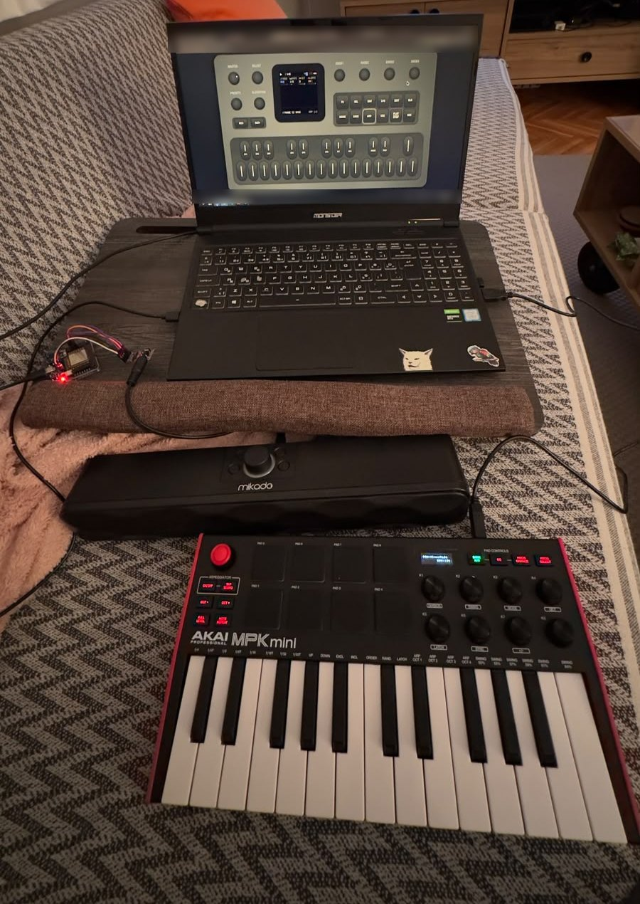
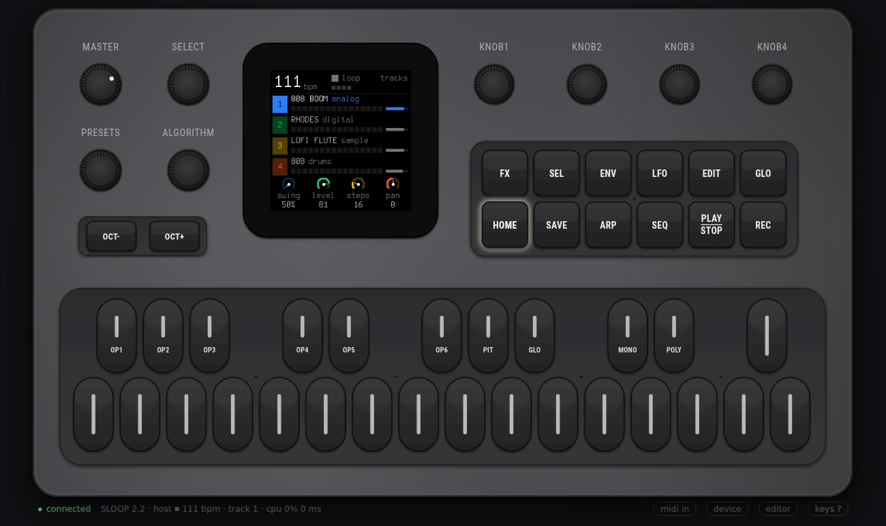
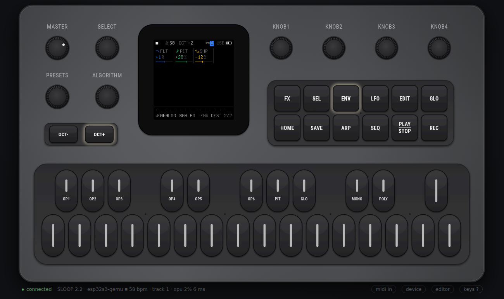
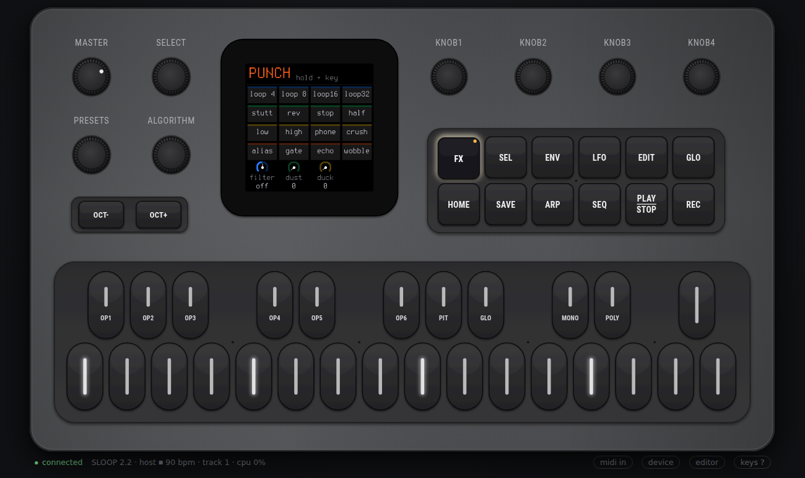
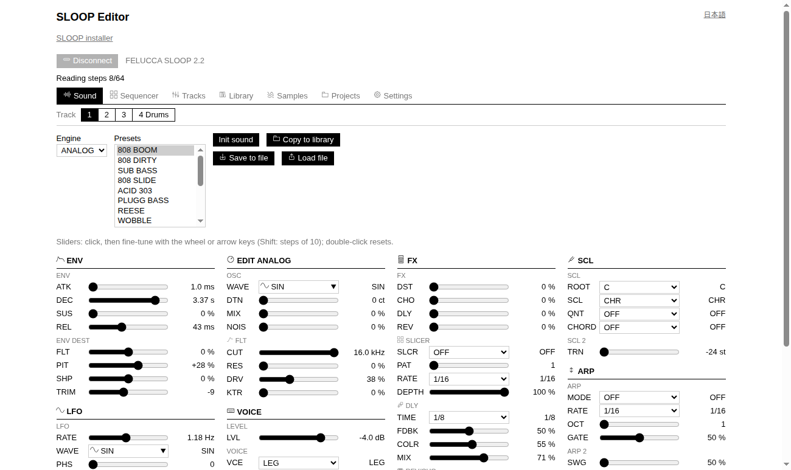
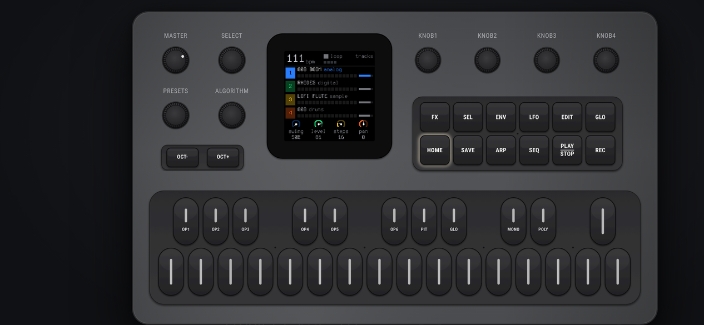
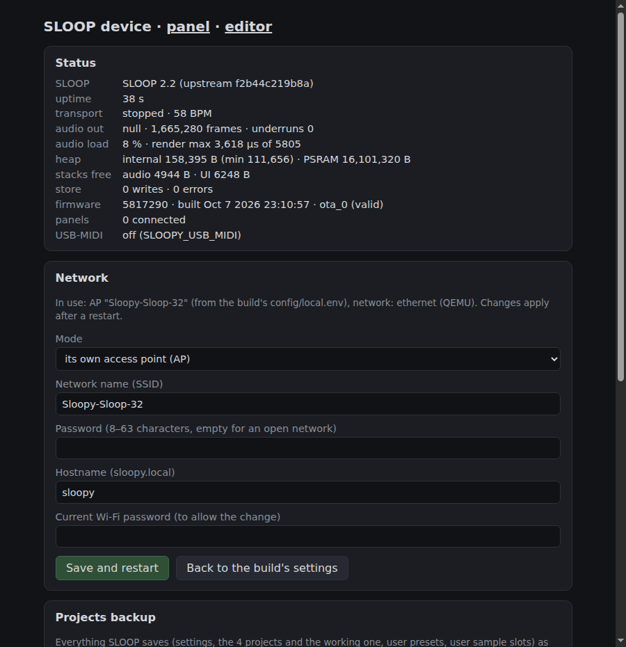
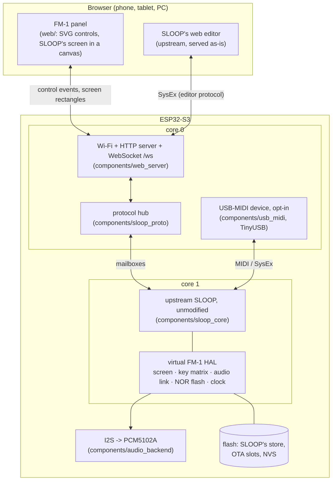

# sloopy-sloop-32

**SLOOP, the live groovebox firmware for the M-VAVE FM-1, running natively on an ESP32-S3 with a
PCM5102A DAC. A web browser stands in for the FM-1's front panel.**

[](LICENSE)


<table>
  <tr>
    <td width="34%" valign="top">
      
    </td>
    <td valign="top">
      
      
    </td>
  </tr>
  <tr>
    <td valign="top"><sub><b>The real thing.</b> An ESP32-S3 module and a PCM5102A DAC (left, red LED)
    run SLOOP. The laptop only shows the panel over Wi-Fi, and an AKAI MPK mini 3 plays it.</sub></td>
    <td valign="top"><sub><b>Top:</b> the browser panel with SLOOP's own TRACKS screen.
    <b>Bottom:</b> the same panel served by the ESP32-S3 firmware running in Espressif's QEMU
    (status line: <code>esp32s3-qemu</code>).</sub></td>
  </tr>
</table>

<table>
  <tr>
    <td width="50%"></td>
    <td width="50%"></td>
  </tr>
  <tr>
    <td><sub>Hold <b>FX</b>: SLOOP's punch-in effects layer. Keys 1, 5, 9 and 13 light up as on the FM-1.</sub></td>
    <td><sub>SLOOP's own web editor (upstream code), served by the device and connected over the WebSocket instead of USB.</sub></td>
  </tr>
  <tr>
    <td></td>
    <td></td>
  </tr>
  <tr>
    <td><sub>On a phone, with multi-touch: hold a button with one finger and play keys with others.</sub></td>
    <td><sub>The device page (here from QEMU): live status, network settings, project backup and restore, firmware update.</sub></td>
  </tr>
</table>

<details>
<summary><b>QEMU console: the firmware's self-test</b> (<code>./scripts/test-qemu.sh</code>)</summary>

```text
I (17) boot: ESP-IDF v5.5.5 2nd stage bootloader
I (181) esp_psram: Found 16MB PSRAM device
I (213) sloopy: sloopy-sloop-32: SLOOP 2.2 on ESP32-S3 rev 0, 2 cores, ESP-IDF v5.5.5
I (213) sloopy: upstream SLOOP f2b44c219b8a, profile qemu
I (217) sloopy: flash 16777216 bytes, PSRAM 16777216 bytes
I (218) sloopy: heap: internal free 231659, PSRAM free 16218176; SLOOP .pool in PSRAM: 556456 bytes
I (591) web: web panel on port 80 (11 files embedded)
I (626) sloop_port: SLOOP_BOOTED
I (1593) net: IP 10.0.2.15: the panel is at http://10.0.2.15/
I (2141) selftest: UI task: SLOOP's main loop runs                              ok
I (2143) selftest: display: screens published (logo, TRACKS)                    ok
I (2226) selftest: transport: PLAY -> playing                                   ok
I (3229) selftest: audio: a key on track 1 is heard                             ok
I (3613) selftest: encoder: KNOB 2 changes track 1's level                      ok
I (20478) selftest: store: the autosave writes the project to the "sloop" partition ok
I (20984) selftest: heap: integrity                                              ok
SLOOP_QEMU_PHASE1_DONE level=88
   ... esp_restart: the chip reboots on the same flash ...
I (12922) selftest: store: the project came back from flash after a restart      ok
I (43982) selftest: random use: audio kept coming                                ok
I (43983) selftest: random use: the output stayed inside 24 bits                 ok
I (43984) selftest: random use: task stacks kept > 1 KB free                     ok
I (44571) selftest: random use: SLOOP still answers PLAY                         ok
SLOOP_QEMU_PASS
```

</details>

---

## Contents

- [What this is (and why)](#what-this-is-and-why)
- [Credits and thanks](#credits-and-thanks)
- [Status](#status)
- [How it works](#how-it-works)
- [Hardware and wiring](#hardware-and-wiring)
- [Getting started](#getting-started)
  - [1. Set up the machine](#1-set-up-the-machine)
  - [2. Play it on the PC (no board)](#2-play-it-on-the-pc-no-board)
  - [3. Run the firmware in QEMU](#3-run-the-firmware-in-qemu)
  - [4. Flash a real board](#4-flash-a-real-board)
- [MIDI keyboards](#midi-keyboards)
- [The browser panel](#the-browser-panel)
- [Scripts](#scripts)
- [Configuration](#configuration)
- [Tests](#tests)
- [Repository layout](#repository-layout)
- [Using SLOOP itself](#using-sloop-itself)
- [Limitations and known issues](#limitations-and-known-issues)
- [License](#license)

---

## What this is (and why)

[SLOOP](https://github.com/isod89/sloop-fm1) is a custom firmware for the **M-VAVE FM-1**, a small
MIDI keyboard with a screen built around a JieLi AC79 chip. SLOOP turns it into a four-track live
groovebox: three synths, a drum machine, effects, a sequencer and a song mode.

**sloopy-sloop-32** takes that firmware off the FM-1 and runs it on an **ESP32-S3**, a
general-purpose microcontroller board that costs a few dollars:

- **Native port, not an emulator.** Upstream SLOOP's C sources compile **unmodified**. Only the
  FM-1's hardware layer is replaced, by a small *virtual FM-1*: screen, key matrix, audio link,
  flash and clock.
- **The browser is the front panel.** The board has no screen, buttons or knobs. Any browser on the
  same network shows a faithful FM-1 panel and SLOOP's real screen, sent pixel for pixel. Its
  buttons, keys and knobs drive SLOOP exactly as the FM-1's would.
- **Audio** comes out of a PCM5102A I2S DAC at 44.1 kHz, 24-bit, stereo.

**Why?** For fun, and as a proof of concept. The goal was to show that a groovebox firmware
written for one specific, closed piece of hardware can be lifted, untouched, onto cheap open
hardware. Development was done mostly before the board arrived, using a host build and Espressif's
QEMU, and then it worked on the real chip. This is a hobby project, not a product, and it is not
affiliated with M-VAVE or with SLOOP's author.

## Credits and thanks

This project exists only because of other people's work. Thank you!

- **[SLOOP](https://github.com/isod89/sloop-fm1)** by **isod89**: the groovebox itself. The
  engines, drums, effects, sequencer, UI, screens, presets and web editor are all SLOOP's, compiled
  here unchanged. Tested revision: SLOOP 2.2, commit `f2b44c219b8a` (`config/upstream.lock`).
  If you have an FM-1, install the real thing; see SLOOP's README for its browser installer.
- **[Felucca](https://github.com/hugelton/Felucca)** by **Leo Kuroshita
  ([@kurogedelic](https://github.com/kurogedelic)), Hügelton Instruments**: the open FM-1 firmware
  SLOOP is built on: the groundwork of running open code on the FM-1 at all. Also by the same
  author:
  [FM-1-transporter](https://github.com/kurogedelic/FM-1-transporter), the FM-1 recovery tool.
- Third-party material inside SLOOP, as listed in its `LICENSING.md`: CC0 instrument and drum
  samples (Versilian Studios VSCO-2 CE and VCSL; Sonic Pi), the Terminus font (SIL OFL), the
  Fukiai icon font (MIT) used by the editor, CrispyZebra (oscillator, GPL-3.0) and klattsch
  (design reference for the formant voice).
- **[Espressif](https://github.com/espressif)**: ESP-IDF, the ESP32-S3 fork of QEMU and
  esp_tinyusb; **[TinyUSB](https://github.com/hathach/tinyusb)** for the USB-MIDI device.

SLOOP is fetched from its own repository at build time (`scripts/fetch-sloop.sh`); it is not
copied into this one.

## Status

| Part | State |
| --- | --- |
| SLOOP on Linux (host app: audio, browser panel, web editor) | works, host tested |
| ESP32-S3 firmware in QEMU (boot, PSRAM, flash store, web panel over emulated Ethernet) | works, QEMU tested |
| Cross-target check: the ESP32-S3 build renders bit-identical audio to the Linux build | passes |
| Firmware update and project backup / restore from the browser | works, QEMU tested (also driven in Chrome) |
| **Real ESP32-S3 + PCM5102A**: boot, octal PSRAM, I2S audio, Wi-Fi, the panel | **works on hardware**: first boot and first sound in October 2026 |
| A MIDI keyboard (AKAI MPK mini 3) playing the board through the PC | works on hardware (`scripts/midi-bridge.py`) |
| Long-run hardware tests (sample-rate accuracy, 10 min under load, latency, OTA over Wi-Fi) | pending: [docs/HARDWARE_TESTS.md](docs/HARDWARE_TESTS.md) |
| USB-MIDI device on the ESP32-S3's native USB port (opt-in) | builds, bridge host tested; not yet tried on hardware |

The full log, with what was measured and how: [PROGRESS.md](PROGRESS.md),
[NEXT_STEPS.md](NEXT_STEPS.md), [KNOWN_ISSUES.md](KNOWN_ISSUES.md).

## How it works



**The core.** `components/sloop_core/port/sloop_unity.c` includes upstream's `firmware/src/*.c` in
upstream's own order, against a virtual FM-1 HAL (`port/hal/*.h`) that stands in for upstream's
JieLi register headers. Two upstream files are replaced: `main.c` (by `sloop_runtime.c`: boot, the
UI loop body, the audio render, the mailboxes) and `usb.c` (by `sloop_usb_shim.c`: the same MIDI
and SysEx rings). Nothing under `upstream/` is edited. The same unity build runs on Linux and on the
ESP32-S3.

**Where the original's parts went:**

| On the FM-1 (upstream) | In this port |
| --- | --- |
| engines, drums, voices, FX, sequencer, arranger, UI, screens, projects, presets, editor protocol (`firmware/src/`) | **reused unchanged** |
| ST7789 LCD driven by `lcd.c` | `lcd.c` unchanged, talking to a virtual ST7789: a 240x240 framebuffer whose changed rectangles stream to the browser (~30/s) |
| key / button / encoder matrix, LEDs | a virtual matrix, fed by browser events with hardware-like timing (presses last >= 20 ms, one encoder detent per UI pass) |
| ALNK audio link + DAC, audio ISR | `audio.c` unchanged; the audio task renders 256-frame halves and `i2s_channel_write` blocks on the DMA, so the I2S clock paces SLOOP |
| 1 MiB NOR flash, A/B storage | SLOOP's `storage.c` unchanged on a 448 KiB `sloop` partition with NOR semantics |
| TIMER interrupts, IRQ masking | the UI task (~1 ms steps) and an audio lock with the same exclusion |
| USB-MIDI + SysEx (`usb.c`) | the WebSocket hub, and optionally a TinyUSB USB-MIDI device with the same descriptor |
| M-UPGRADE updates, recovery (`ota.c`, `recovery.c`) | not built; ESP-IDF OTA slots with rollback, from the device page |

**Concurrency.** SLOOP was written for one core with an audio interrupt. On the ESP32-S3 both of
its tasks are pinned to core 1 (audio at priority 20, UI at 5), so the UI never sees half a render,
as on the FM-1. Wi-Fi, lwIP, the web server and USB run on core 0 and talk to SLOOP only through
mailboxes.

**Memory.** Hot DSP state, voices, mixer, audio buffers and I2S DMA stay in internal RAM. SLOOP's
large `.pool` section (delay, chorus and reverb lines, slicer and punch rings, canvases, ~553 KB)
is placed in PSRAM by a linker fragment.

**Flash layout** (`config/partitions.csv`, 16 MB): two 4 MB app slots (`ota_0`, `ota_1`), the
`sloop` store (448 KiB, SLOOP's flash window), a 512 KiB `stage` partition for backup restores,
NVS, and a core-dump partition.

More: [docs/ARCHITECTURE.md](docs/ARCHITECTURE.md), and the file-by-file upstream map in
[docs/UPSTREAM_MAP.md](docs/UPSTREAM_MAP.md).

## Hardware and wiring

### What you need

| Part | Notes |
| --- | --- |
| ESP32-S3 board or module with **16 MB octal PSRAM** and >= 16 MB flash | "N16R16" class. A module with 32 MB *octal* flash (N32R16V class) works too: the build detects octal flash on its own. |
| PCM5102A DAC breakout | the common purple "GY-PCM5102" board works |
| USB cable | flashing and power |
| Headphones or an amplifier | into the DAC's 3.5 mm jack |
| Optional: a USB MIDI keyboard | see [MIDI keyboards](#midi-keyboards) |

No screen, no buttons, no SD card: the browser is the panel.

### PCM5102A wiring

The firmware drives three I2S lines. Choose the GPIOs yourself and write them into
`config/local.env`; pins are never hard-coded in the source, because boards differ.

| PCM5102A pin | Connect to | Notes |
| --- | --- | --- |
| VIN | 3V3, or 5V if the board has a regulator (the purple board does) | |
| GND | GND | |
| BCK | `SLOOPY_I2S_BCLK_GPIO` | bit clock |
| LCK | `SLOOPY_I2S_WS_GPIO` | word select (LRCK) |
| DIN | `SLOOPY_I2S_DOUT_GPIO` | data |
| SCK | **GND** | no MCLK: the DAC makes its own clock from BCK. Left floating, it may stay silent. |
| FMT | GND | I2S format |
| XSMT | 3V3 | soft-mute off. Left open, the DAC stays muted. |
| FLT, DEMP | GND | normal filter, no de-emphasis |

On the purple board, FLT / DEMP / XSMT / FMT are the solder jumpers 1-4 on the back. Bridge them
**1 L, 2 L, 3 H, 4 L**; they often ship open.

**Which GPIOs?** On a DevKitC-style board, GPIO **4 / 5 / 6** are free. Avoid:

- **26-37**: flash and octal PSRAM (the config script refuses these);
- **19, 20**: native USB;
- **43, 44**: UART0, the serial console;
- **0, 3, 45, 46**: strapping pins;
- **38 or 48**: the RGB LED on many boards.

`scripts/generate-local-sdkconfig.sh` refuses or warns about each of these.

### If your labels lie: modules in adapters

The board in the photo is a bare ESP32-S3 module sitting in an adapter / programming board made for
the classic **ESP32-WROOM-32**. The outline is the same, so GND, 3V3, EN, TX and RX line up and the
module powers up and flashes. **The other labels are the WROOM-32's GPIO numbers, not the S3's**:
on that adapter "IO33" is really GPIO 16, and "IO16" / "IO17" reach no usable pin at all.

`scripts/probe-pins.sh` finds out without a multimeter. It holds the chip in its ROM download mode,
so no firmware runs and no pin is driven. It reports which pins are tied high or low, then prints
every GPIO you touch with a GND wire. The measured map for this adapter is in
[docs/HARDWARE.md](docs/HARDWARE.md). The setup in the photo uses:

| PCM5102A | Adapter label | Real ESP32-S3 GPIO | `config/local.env` |
| --- | --- | --- | --- |
| BCK | IO33 | 16 | `SLOOPY_I2S_BCLK_GPIO=16` |
| LCK | IO34 | 6 | `SLOOPY_I2S_WS_GPIO=6` |
| DIN | IO35 | 7 | `SLOOPY_I2S_DOUT_GPIO=7` |
| VIN / GND / SCK | 3V3 / GND / GND | | |

### No sound? Check, in order

1. Are SCK and the solder jumpers set (above)? A floating SCK or an open XSMT is the classic cause.
2. Does the console say `I2S TX: 44100 Hz, 32-bit stereo, BCLK .., WS .., DOUT ..` with your pins?
3. Does `/api/status` show `audio.peak` above 0 after you play a key? Then the firmware is sending
   sound, and the problem is wiring.
4. Do the wires reach the GPIOs you think? Run `scripts/probe-pins.sh`.
5. Sound on only one side? Try another DAC board: the first board in this project had a dead
   channel. The firmware sends both channels.

## Getting started

### 1. Set up the machine

The scripts target Linux and were developed on Nobara / Fedora:

```bash
git clone <this repository> sloopy-sloop-32 && cd sloopy-sloop-32
./scripts/bootstrap-nobara.sh   # system packages (asks for sudo, shows the list first), ESP-IDF v5.5.5,
                                # the ESP32-S3 toolchain, Espressif's QEMU, upstream SLOOP
./scripts/doctor.sh             # checks everything and prints the command for anything missing
```

On other distributions, install the equivalents of the bootstrap's package list (ESP-IDF's Linux
prerequisites: `git cmake ninja flex bison gperf ccache dfu-util libusb`; Python 3 with Pillow and
pytest; QEMU's runtime libraries `SDL2 libslirp libgcrypt glib2 pixman`; the ALSA development files
and `nodejs` for the host app and tests). Then run the bootstrap with `SKIP_DNF=1`. ESP-IDF is installed under `tools/esp-idf`, at the commit pinned
in `config/upstream.lock`. `scripts/fetch-sloop.sh` clones SLOOP into `upstream/sloop-fm1` at the
locked commit; set `SLOOP_REF=main` to try a newer SLOOP.

### 2. Play it on the PC (no board)

```bash
./scripts/serve-web.sh          # builds and starts the host app; sound on the PC's sound card
# open http://127.0.0.1:8080/
```

This is SLOOP compiled for Linux, with the same browser panel and web editor. Useful options:
`./scripts/serve-web.sh 8080 --bind 0.0.0.0` lets a phone on your LAN connect;
`--audio null` runs without sound; `--wav out.wav` records the output.

### 3. Run the firmware in QEMU

Espressif's QEMU fork emulates the ESP32-S3 well enough to run the **real firmware image**: the
bootloader, partition table, FreeRTOS on two cores, PSRAM, the flash store and the web server.

```bash
./scripts/build-qemu.sh         # the firmware with the QEMU profile -> build-qemu/
./scripts/run-qemu.sh           # boot it: console in the terminal (Ctrl-A X quits)
# the firmware's own web panel: http://127.0.0.1:18080/
./scripts/test-qemu.sh          # automated: build, boot, self-test, web tests -> "QEMU test: PASS"
```

**What happens on boot.** The QEMU profile includes a self-test (`main/selftest.c`):

- Phase 1 checks PSRAM, plays, presses keys, turns knobs, waits for SLOOP's autosave into flash,
  then restarts the chip.
- Phase 2 checks that the project came back from flash, then randomly uses the panel for 30 s.
- It ends with `SLOOP_QEMU_PASS` (about 45 s). After that, SLOOP and the panel keep running.

**QEMU setup** (`scripts/run-qemu.sh`):

| Setting | Value | Why |
| --- | --- | --- |
| machine | `esp32s3`, Espressif QEMU 9.2.2 | |
| flash | 16 MB image from the build (`build-qemu/flash_image.bin`) | |
| PSRAM | 16 MB, **quad** mode | this QEMU crashes on octal PSRAM accesses; the hardware build uses octal |
| network | OpenCores Ethernet, user-mode NAT, `hostfwd` 127.0.0.1:18080 -> guest :80 | QEMU has no Wi-Fi radio |
| audio | the *null* backend, paced by the system timer | QEMU has no I2S |
| TCG | multi-threaded by default | the OTA / backup test runs single-threaded (see Known issues) |

| Variable | Effect |
| --- | --- |
| `KEEP_FLASH=1` | reuse the last run's flash image: NVS and SLOOP's store survive, and a self-test that already passed stays idle (`SLOOP_QEMU_IDLE`). It also keeps the **old firmware**, so drop it after a rebuild. |
| `QEMU_WEB_PORT=18080` | the host port forwarded to the firmware's web server |
| `QEMU_LOG=file` | non-interactive: console to a file, stdin from `/dev/null` |
| `QEMU_TCG_THREAD=single` | single-threaded TCG |

**What QEMU proves, and what it can't.** It proves boot, memory layout, PSRAM use, tasks on both
cores, the flash store across a restart, the web panel and protocol, firmware update and backup
flows, and SLOOP's DSP on Xtensa: the firmware's render hash equals the Linux build's.

It does **not** prove real-time behaviour, I2S timing, octal PSRAM, Wi-Fi, or coexistence with
audio; those are hardware tests. `scripts/qemu-cpu-estimate.sh` uses QEMU's instruction counting
to estimate the audio CPU load before you have a board: 29-44 % of one core for a 4-track song.
Details: [docs/EMULATION.md](docs/EMULATION.md).

### 4. Flash a real board

**a. Configure.** Copy the example and edit it. The file is gitignored: your Wi-Fi password and
pins never go into git.

```bash
cp config/local.env.example config/local.env
$EDITOR config/local.env
```

```bash
SLOOPY_WIFI_MODE=STA                 # STA: join your Wi-Fi. AP: the board makes its own network
SLOOPY_WIFI_SSID=your-network        # 2.4 GHz only (ESP32-S3)
# your Wi-Fi password (AP mode: at least 8 characters)
SLOOPY_WIFI_PASSWORD=change-this-password
SLOOPY_I2S_BCLK_GPIO=4               # your three I2S pins (see the wiring section)
SLOOPY_I2S_WS_GPIO=5
SLOOPY_I2S_DOUT_GPIO=6
SLOOPY_USB_MIDI=0                    # 1: USB-MIDI device on the native USB port (see MIDI)
SLOOPY_SERIAL_PORT=/dev/ttyACM0      # or /dev/ttyUSB0
```

**b. Flash.** Connect the board's **UART / COM** USB port (the one with the USB-serial chip):

```bash
./scripts/flash.sh              # builds build-hw/ and flashes; or ./scripts/flash.sh /dev/ttyUSB0
./scripts/monitor.sh            # serial console (Ctrl-] quits)
```

If it can't connect, hold **BOOT** and tap **RST** (EN), then retry. On Linux, add yourself to the
`dialout` group if the port says *Permission denied*.

**c. Check the boot log.** You should see:

```text
I (1324) sloopy: flash 16777216 bytes, PSRAM 16777216 bytes
I (1348) audio: I2S TX: 44100 Hz, 32-bit stereo, BCLK 16, WS 6, DOUT 7, DMA 4 x 256 frames
I (1518) sloopy: SLOOPY_APP_READY
I (1953) sloop_port: SLOOP_BOOTED
I (5493) net: IP 192.168.x.y: the panel is at http://192.168.x.y/
I (11518) sloopy: stats: stopped, cpu 8%, render max 1066 us, underruns 0, ...
```

**d. Open the panel** at the address printed by `net:`, or at `http://sloopy.local/` (mDNS).

- In **AP** mode, join the board's network and open `http://192.168.4.1/`.
- In **STA** mode, if the network can't be reached after 8 tries, the board opens its own access
  point named after its hostname. It uses the same password, so it never ends up unreachable.

**e. Afterwards, from the browser** (`http://<board>/device.html`, the **device** link on the
panel):

- **Network:** change Wi-Fi and hostname without rebuilding; stored in NVS.
- **Projects backup:** download everything SLOOP saved as one file, or restore it.
- **Firmware:** upload a new `build-hw/sloopy_sloop_32.bin`. It is written to the other OTA slot
  and the board restarts into it. An image that doesn't come up rolls back by itself.

Each of these asks for the current Wi-Fi password.

Then work through [docs/HARDWARE_TESTS.md](docs/HARDWARE_TESTS.md) (H-1 ... H-15) to validate a board.

## MIDI keyboards

SLOOP's MIDI input follows upstream (`seq.c`):

| MIDI channel | Plays |
| --- | --- |
| 1, 2, 3 | synth tracks 1, 2, 3 |
| 10 | the drums (each note plays the nearest of the 16 drum sounds) |
| any other | the track selected on the panel |

An **AKAI MPK mini 3** sends its keys on channel 1 and its pads on channel 10 by default: keys play
synth 1, pads play drums. Three ways to connect a keyboard:

### A. Keyboard on a Linux PC, no browser involved (recommended)

```bash
python3 scripts/midi-bridge.py --follow                         # the board at sloopy.local
python3 scripts/midi-bridge.py --device 192.168.x.y --port 24:0 # explicit board and ALSA port
```

The bridge reads the keyboard's ALSA port (via `aseqdump`) and sends each note over the panel's
WebSocket. It reads every hardware MIDI input unless you name a `--port` (list them with
`aseqdump -l`).

`--follow` moves everything except channel 10 to channel 16, so the keyboard plays **the track
selected on the panel**, as the panel's own keys do. The pads still play drums. The added delay on
the PC is about 6 ms; Wi-Fi and the 23 ms audio buffer add the rest.

### B. Keyboard on the computer or phone running the browser (Web MIDI)

The panel's **midi in** button uses Web MIDI. Browsers only allow Web MIDI on `https://` or
`localhost` pages, and the board serves plain `http://`. Two ways around it:

```bash
./scripts/panel-localhost.sh            # forwards http://localhost:8080/ to the board
# open http://localhost:8080/ in Chrome, press "midi in", allow MIDI -> "midi in (1)"
```

Or, in Chrome (desktop or Android): open `chrome://flags/#unsafely-treat-insecure-origin-as-secure`,
add `http://<board-address>`, enable it and restart Chrome.

Chrome and Edge support Web MIDI; Firefox needs a site-permission add-on, Safari doesn't support
it. Use either A or B, not both, or every note arrives twice.

### C. The board as a USB-MIDI device (like the FM-1)

With `SLOOPY_USB_MIDI=1`, the ESP32-S3's **native USB** port becomes a class-compliant USB-MIDI
device named "Felucca (sloopy-sloop-32)", with the FM-1's own USB descriptor. DAWs see it, and
SLOOP's original web editor finds it over Web MIDI as it would an FM-1.

- The native USB port then stops being a serial / flash port, so flash through the UART port.
- On adapter boards the native USB lines (GPIO 19 / 20) may not reach a connector.
- This path is built and host tested, but **not yet tried on hardware**. See
  [docs/CONFIGURATION.md](docs/CONFIGURATION.md).

## The browser panel

The panel (`web/`) is plain HTML / SVG / JavaScript, about 15 KB gzipped (the whole web UI, with
SLOOP's editor and its icon font, is ~130 KB), embedded in the firmware. It reproduces the FM-1's layout from measured geometry
([docs/UI_SPEC.md](docs/UI_SPEC.md)): 14 buttons, 27 keys, 8 knobs, and SLOOP's 240x240 screen.

| Control | How |
| --- | --- |
| **Touch** | multi-touch: hold a button with one finger and play keys with others (SLOOP's layers) |
| **Mouse** | click and hold. Right-click latches a button or key down; right-click again or `Esc` releases. |
| **Computer keyboard** | `Z`...`/` white keys F3-A4, `S D F H J L ; '` their black keys, `Q W E R T Y` B4-G5 with `3 4 6`; `Space` PLAY/STOP; `[` `]` OCT- / OCT+ |
| **Knobs** | drag up / down, mouse wheel, or arrow keys when focused |

The panel sends **semantic events** (button down / up, key with velocity, encoder detents) over a
versioned WebSocket protocol ([docs/PROTOCOL.md](docs/PROTOCOL.md)). The board answers with
binary screen rectangles, LED states and status. The screen is SLOOP's own framebuffer; no screen
logic is re-implemented in JavaScript. Several browsers can connect at once, and they all see the
same SLOOP.

Footer links: **midi in**, **device** (status, network, backups, firmware), **editor** (SLOOP's
full parameter editor), **keys ?** (help).

## Scripts

All in `scripts/`. `make <target>` shortcuts are in the `Makefile`.

| Script | `make` | What it does |
| --- | --- | --- |
| `bootstrap-nobara.sh` | `setup` | Install system packages, ESP-IDF v5.5.5 + ESP32-S3 toolchain + QEMU, fetch SLOOP. Idempotent. |
| `doctor.sh` | `doctor` | Check the environment and print the command to fix anything missing. |
| `fetch-sloop.sh` | `fetch` | Clone upstream SLOOP into `upstream/sloop-fm1` at the locked commit (`SLOOP_REF` overrides). |
| `build-host.sh` | `host` | Build the Linux target: SLOOP core, host app, host tests -> `build-host/`. |
| `serve-web.sh` | `web` | Run the host app with the browser panel at `http://127.0.0.1:8080/`. |
| `test-upstream.sh` | `test-upstream` | Run upstream SLOOP's own test suite (no JieLi toolchain needed). |
| `test-host.sh` | `test-host` | Layout checks, upstream's suite, the port's host tests, web tests in headless Chrome. |
| `build-qemu.sh` | `build-qemu` | Build the firmware with the QEMU profile -> `build-qemu/`. |
| `run-qemu.sh` | `qemu` | Boot it in ESP32-S3 QEMU (options above). |
| `test-qemu.sh` | `test-qemu` | Build, boot, self-test, cross-target hash, web tests, then a second boot for backup / OTA tests. |
| `qemu-cpu-estimate.sh` | | Estimate SLOOP's CPU load on the ESP32-S3 from QEMU instruction counts. |
| `generate-local-sdkconfig.sh` | | `config/local.env` -> `config/sdkconfig.local.defaults` (gitignored); checks pins. Run by the build. |
| `build-hardware.sh` | `build` | Build the real-hardware firmware -> `build-hw/`. |
| `configure-hardware.sh` | `config` | `menuconfig` for the hardware build. |
| `flash.sh [port]` | `flash` | Build if needed, then flash over serial. |
| `monitor.sh [port]` | `monitor` | Serial console of the board. |
| `probe-pins.sh [port]` | | Find which GPIO a wire reaches (touch it with GND); no firmware involved. |
| `panel-localhost.sh [board]` | | Serve the board's panel at `http://localhost:8080/` so Web MIDI works. |
| `midi-bridge.py` | | Play the board from a MIDI keyboard on a Linux PC (ALSA). |
| `clean.sh` | `clean` | Remove build outputs (not the toolchain, not your config). |

## Configuration

| Where | What |
| --- | --- |
| `config/local.env` (yours, gitignored) | Wi-Fi mode / SSID / password, hostname, the three I2S pins, USB-MIDI on/off, serial port |
| `sdkconfig.defaults` | shared ESP-IDF settings: 16 MB flash, octal PSRAM at 80 MHz, partitions, caches, rollback |
| `config/sdkconfig.hardware.defaults` | hardware profile: Wi-Fi, 240 MHz, Wi-Fi / lwIP buffers in PSRAM |
| `config/sdkconfig.qemu.defaults` | QEMU profile: quad PSRAM, Ethernet, null audio, self-test |
| `main/Kconfig.projbuild` | project options: web port, mDNS, sample rate (44100), I2S DMA depth, USB-MIDI VID / PID / name |
| NVS on the board | network settings changed from the device page |

Full reference: [docs/CONFIGURATION.md](docs/CONFIGURATION.md).

## Tests

```bash
./scripts/test-host.sh     # ~2 min: layout + upstream SLOOP's suite + the port's tests + browser tests
./scripts/test-qemu.sh     # ~3-4 min: the firmware in QEMU
```

- **Host** (11 suites):
  - upstream's own tests, unmodified;
  - boot, self-test hash and a feature walk-through driven through the virtual panel;
  - a soak test;
  - protocol and WebSocket server tests;
  - the USB-MIDI bridge and store-backup checks;
  - the panel's geometry in node;
  - the panel, editor and device page in headless Chrome.
- **QEMU:**
  - the two-phase self-test;
  - the cross-target render hash: the firmware and the Linux build must produce bit-identical
    audio;
  - the WebSocket end-to-end test against the firmware;
  - backup / restore and firmware update, through the API and through the device page in Chrome.
- **Hardware:** the checklist in [docs/HARDWARE_TESTS.md](docs/HARDWARE_TESTS.md), with results
  in [PROGRESS.md](PROGRESS.md).

## Repository layout

```text
components/
  sloop_core/      upstream SLOOP via port/sloop_unity.c; port/hal/ = the virtual FM-1
  sloop_port/      the ESP-IDF platform: clock, locks, flash store, backups
  audio_backend/   I2S -> PCM5102A (null backend for QEMU)
  web_server/      Wi-Fi / Ethernet, HTTP + WebSocket, device page APIs, OTA, backups
  sloop_proto/     the panel protocol hub (shared by firmware and host app)
  usb_midi/        USB-MIDI device (TinyUSB) and its portable bridge
main/              app_main, Kconfig options, the QEMU self-test
host/              the Linux host app and platform (ALSA / WAV / null audio, WebSocket server)
web/               the browser panel, device page, editor bridge
tests/             host tests (C), web tests (Python, node, headless Chrome)
scripts/           everything above
config/            partitions, sdkconfig profiles, local.env example, upstream.lock
docs/              architecture, protocol, configuration, emulation, hardware, UI spec, upstream map
upstream/          SLOOP is cloned here by fetch-sloop.sh (gitignored, not vendored)
```

## Using SLOOP itself

Everything musical is SLOOP's, so its own documentation applies. Read
**[SLOOP's README](https://github.com/isod89/sloop-fm1)** and its manual
**[SLOOP.md](https://github.com/isod89/sloop-fm1/blob/main/SLOOP.md)**; after
`scripts/fetch-sloop.sh` you also have it locally at `upstream/sloop-fm1/SLOOP.md`. In short:

- **Four tracks:** three synths and a drum machine with 16 sounds on the white keys.
- **Sounds:** nine synthesis engines and 68 level-matched presets, browsed by kind.
- **Layers:** hold a function button (FX, EDIT, ARP, SEQ, SCL / SEL, GLO, SAVE) and the keys and
  knobs change job. Punch-in effects, step entry, arpeggio, scales and chords, mute / solo, song
  sections.
- **Recording:** a free take sets the loop length and tempo; REC records while playing; undo /
  redo.
- **Memory:** autosave, 4 projects, 32 user presets.
- **Songs:** a live song mode; sections A-D start on the next bar.

The FM-1-specific parts of SLOOP's docs (the USB installer, M-UPGRADE, recovery) don't apply here:
on the ESP32-S3 you flash with `scripts/flash.sh` and update from the device page.

## Limitations and known issues

- **Hardware validation is in progress.** Boot, audio, Wi-Fi and the panel work; long-run audio,
  latency and OTA over Wi-Fi are still being measured ([docs/HARDWARE_TESTS.md](docs/HARDWARE_TESTS.md)).
- **No TRS / DIN MIDI** (upstream doesn't build it either); MIDI goes through the browser, the PC
  bridge, or USB.
- **Web MIDI needs `https` or `localhost`**: see [MIDI keyboards](#midi-keyboards).
- **QEMU quirks** ([KNOWN_ISSUES.md](KNOWN_ISSUES.md)):
  - octal PSRAM crashes it, so the QEMU profile uses quad mode;
  - its multi-threaded TCG can abort during heavy flash remapping, so the OTA / backup boot runs
    single-threaded;
  - its system timer survives `esp_restart`, so restarts are told apart by a boot counter;
  - it must run with stdin from `/dev/null` when not interactive.
- The panel is drawn from measured geometry, not traced from a photo, so it is close but not
  pixel-identical to the FM-1.

## License

**GPL-3.0-only**, like SLOOP and Felucca: see [LICENSE](LICENSE) and
[LICENSE-NOTICE.md](LICENSE-NOTICE.md). SLOOP's assets keep their own terms (upstream
`LICENSING.md`).

SLOOP is by isod89, based on Felucca by Leo Kuroshita (Hügelton Instruments). "M-VAVE" and "FM-1"
are trademarks of their owners; "Felucca" and "Hügelton Instruments" are names of Hügelton
Instruments. This project is not affiliated with or endorsed by any of them.
